

  

<h1 align="center">TrueRenderer</h1>

  <strong>Your photographs. Your colour. Your way.</strong> 
  RAW development, colour tools and editable layers for macOS and Windows.

  <a href="#downloads">Download</a> &nbsp;·&nbsp;
  <a href="https://github.com/antoniodicoratoinfodev/TrueRenderer-releases/releases/tag/v0.2.7-macos.20261115">Release notes</a> &nbsp;·&nbsp;
  <a href="mailto:truerenderer@gmail.com">Support</a>

---

## Account and beta access

**Discover TrueRenderer in beta.** Request access at **[truerenderer@gmail.com](mailto:truerenderer@gmail.com)** and explore a workspace built around your photographs. An account is required; beta access details are provided by the publisher.

## Downloads

<!-- macos-download:start -->

| Platform | Download | Version |
|---|---|---|
| **macOS · Apple Silicon** | **[Download for Mac — Installer PKG · 62 MB](https://github.com/antoniodicoratoinfodev/TrueRenderer-releases/releases/download/v0.2.7-macos.20261115/TrueRenderer-0.2.7-macos.20261115-arm64.pkg)** | 0.2.7 · Beta |
| **Windows · x64** | **[Download for Windows — EXE](https://github.com/antoniodicoratoinfodev/TrueRenderer-releases/releases/download/v0.2.6.2-windows.20261113/TrueRenderer-0.2.6.2-Setup-x64.exe)** | 0.2.6.2 · Beta |

<!-- macos-download:end -->

**Mac:** open the PKG installer, follow the installation steps, then launch **TrueRenderer** from **Applications**. Quit the app before updating; your personal library and backups are retained. Apple Silicon beta: unsigned installer, ad-hoc signed app, not notarized.

**Windows:** run the offline installer. Windows 10/11 x64 with a compatible graphics device/driver; this beta is unsigned. Updates retain your catalog, settings and backups.

[Mac checksum](https://github.com/antoniodicoratoinfodev/TrueRenderer-releases/releases/download/v0.2.7-macos.20261115/SHA256SUMS.txt) · [Windows checksum](https://github.com/antoniodicoratoinfodev/TrueRenderer-releases/releases/download/v0.2.6.2-windows.20261113/TrueRenderer-0.2.6.2-Setup-x64.exe.sha256) · [All releases](https://github.com/antoniodicoratoinfodev/TrueRenderer-releases/releases)

The beta works offline. Sign in with the account provided for beta access.

---

## Explore the workspace

**Gallery preview:** these screenshots show macOS development build 0.2.9.1. The downloadable betas above are earlier versions; some illustrated features are awaiting a future installer update.

Develop RAW photographs, shape colour and refine local details in one desktop workspace. Keep your originals untouched, your adjustments editable and your library on your computer.

**[Explore the beta and downloads](https://github.com/antoniodicoratoinfodev/TrueRenderer-releases)** · **[Request beta access](mailto:truerenderer@gmail.com)**

*Actual macOS 0.2.9.1 interface. Avalanche Lake shown in Before view; no retouch strokes applied. Photographs: NPS / David Restivo and National Park Service; [photograph sources and credits](https://github.com/antoniodicoratoinfodev/TrueRenderer-releases/blob/1819af3e1da9c6f5615c5d4ba20effa26ae7532e/docs/NOTICE.md).*

## From your first selection to your final image

| Your workflow | What you can do |
| --- | --- |
| Find your photographs | Browse folders, grid, detailed list and filmstrip; search filenames and keywords; filter stars, rejects and colour labels. |
| Build a collection | Manual and smart albums, virtual copies, version stacks, manual stacks and custom album ordering. |
| Make a selection | Synchronized comparison, side-by-side and wipe views, fixed colour samples, zoom and pan. |
| Develop your image | Photo profiles, white balance, exposure, tonal controls, RGB curves, saturation, vibrance, crop, geometry, manual optics and detail. |
| Shape your colour | Sixteen shared adjustment tools, sampled colour editing, selective colour, channel mixing and four-wheel grading. |
| Work locally | Editable layers, opacity, tonal fade, shadow/highlight blending and brush, gradient, radial, luminance and colour masks. |
| Retouch and compose | Paint, erase, clone, heal, transform and select; raster composition and editable `.truerenderer` projects. |
| Revisit your decisions | Undo/Redo, history, Before/After, reusable looks and selective copying of adjustments, layers and retouch strokes. |
| Deliver your work | JPEG, PNG and TIFF, destination colour profiles, output dimensions and DPI/PPI; DNG mosaic export for supported RAW sources. |
| Make it yours | English/Italian, themes, four tab styles, saved workspaces, configurable shortcuts and interface scaling. |

Availability depends on platform, camera and recording mode. TrueRenderer is currently a beta; licence purchases and subscriptions are planned for the public version.

## A closer look at the tools

These are cropped screenshots of the actual controls. Selecting a tool for a screenshot does not apply it to the photograph.

### Navigate

Use this tool to inspect the frame and move around the image before choosing a retouch or selection tool. Hold Space to pan the view.

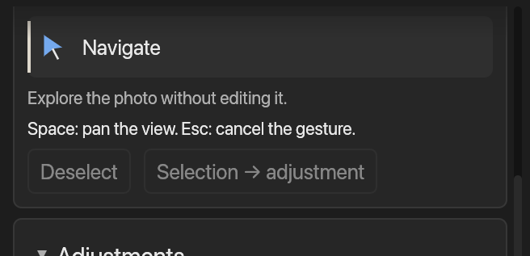

### Move / transform

Set horizontal and vertical position, rotation and scale for the photograph or selected layer. Use the size controls to refine proportions; Option/Alt preserves proportions when dragging a corner.

### Brush

Choose a colour and build a painted correction on the photo or selected layer. Radius sets the brush size, hardness shapes the edge and amount controls its strength.

### Eraser

Remove content under the brush to reveal transparency. Adjust radius, hardness and amount for a broad soft transition or a more precise edge.

### Clone

Option/Alt-click a source point, then paint where you want to copy that detail. Radius, hardness and amount help blend the copied area into its surroundings.

### Heal

Option/Alt-click to choose a source, then paint over the area to repair. Healing adapts the sampled detail to the destination, helping small corrections sit naturally in the image.

### Quick heal

Paint over a small defect and let the tool use nearby image content as its source. It needs an opaque area with a complete nearby source and may be less suitable near edges.

### Freehand selection

Trace an irregular region directly on the photo. Replace, add, subtract or intersect regions, then feather the edge for a softer transition.

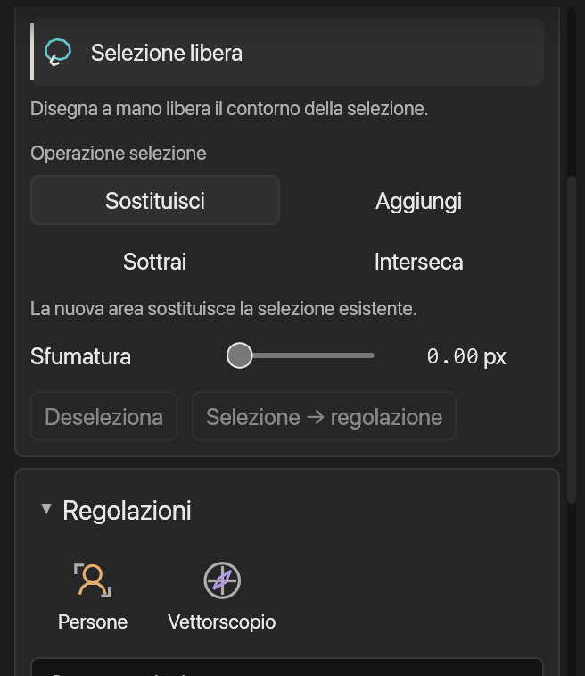

### Polygonal selection

Place vertices around a subject with straight edges; double-click or press Enter to close the outline. Combine it with an existing selection and set feathering before making the next selection.

### Rectangular selection

Drag out a rectangular region for a quick, precise selection. Use replace, add, subtract or intersect to combine regions and feather the edge when needed.

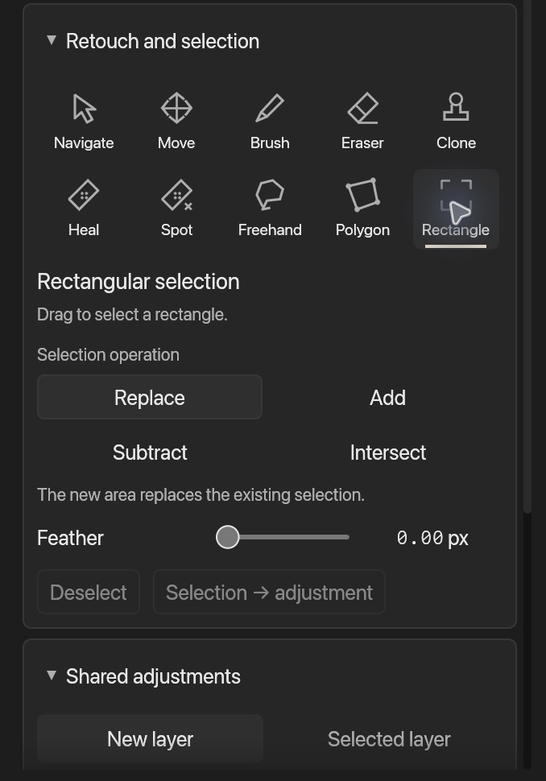

## Develop, layers and export

### Develop

Start with a photo profile, then balance white balance, exposure and the tonal range. The Light controls give separate access to brightness, contrast, highlights, shadows, whites and blacks.

### Layers

Keep adjustments in independently editable layers. Add a correction, select its layer and use a mask when the change should affect only part of the photograph.

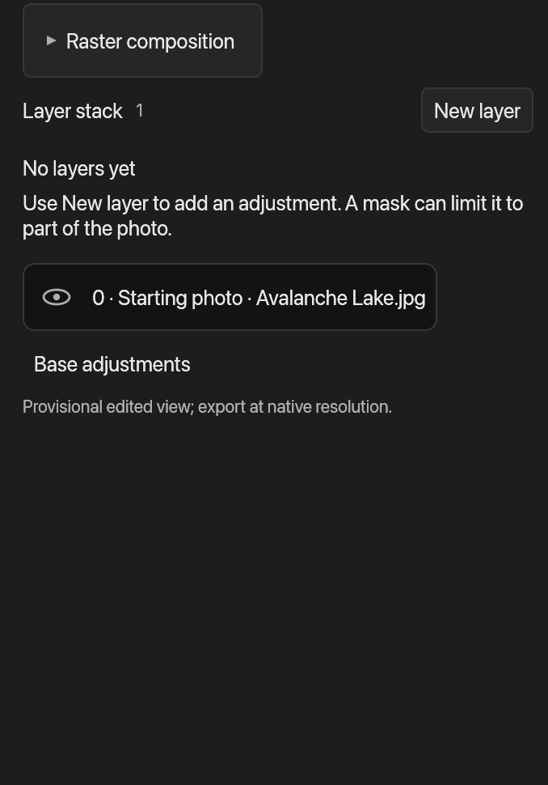

### Export

Choose JPEG, PNG or TIFF, a destination colour profile and the output size. Set quality and resolution where appropriate, then create a new output file while retaining the source.

## Sixteen ways to shape light and colour

### Color editor

Sample a colour on the photograph and refine just that range. Basic, Advanced and Uniformity views help adjust hue, saturation and luminance, control the range and bring its colours closer together.

### Local light and color

Balance a region with exposure, RGB warmth, tint and saturation in one adjustment. Pair it with a mask to work on a foreground, background or other selected area.

### RGB point curves

Shape contrast and colour with a composite RGB curve or separate red, green and blue curves. Add points and refine their input/output coordinates to control particular parts of the tonal range.

### Tonal levels

Set the input black point, white point and gamma, then refine the output range. Composite and individual channel controls let you balance the overall image or a specific channel.

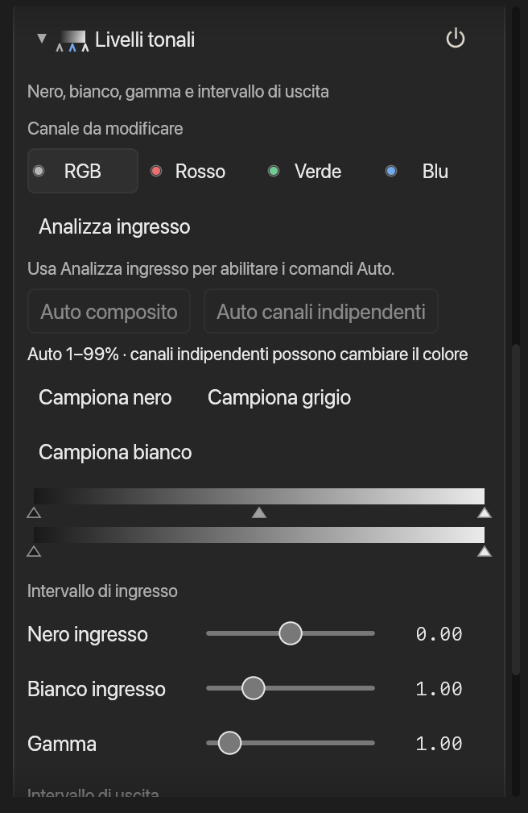

### Mixer and monochrome

Choose one of eight colour families and adjust its hue, saturation and luminance. Use it to refine a palette or explore a monochrome treatment with the black-and-white option.

### Channel mixer

Control how the red, green and blue inputs contribute to each output channel. Per-channel offsets add another way to adjust colour balance and create deliberate colour treatments.

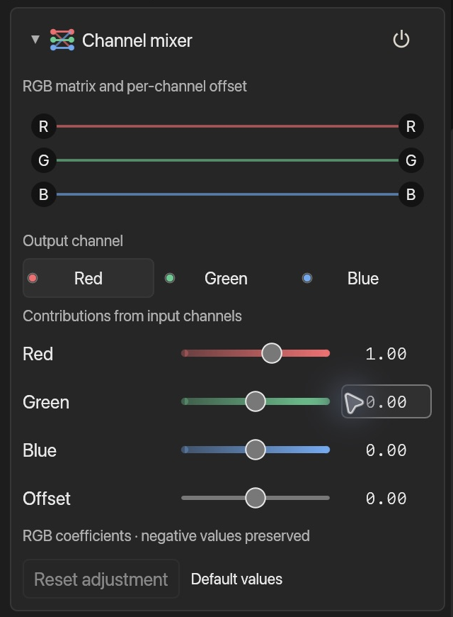

### Four-wheel grading

Choose shadows, midtones, highlights or the global range, then set its hue, chroma and luminance. Tonal transitions control how the ranges meet for a more unified grade.

### Black and white mixer

Convert the image to monochrome, then balance the brightness of eight original colour families. These controls help separate subjects that have similar brightness but different colours.

### Color filter

Choose a filter hue and increase density to introduce a warm, cool or creative tint. Luminance preservation lets you retain brightness while changing the colour treatment.

### Gradient map

Associate dark and bright tones with an editable palette. Add and edit colour stops, reverse the palette and use the amount control to blend the treatment into the photograph.

### Selective color

Choose one of nine colour families and refine its cyan, magenta, yellow and black components. Relative and absolute modes provide different responses for subtle palette changes or stronger colour treatments.

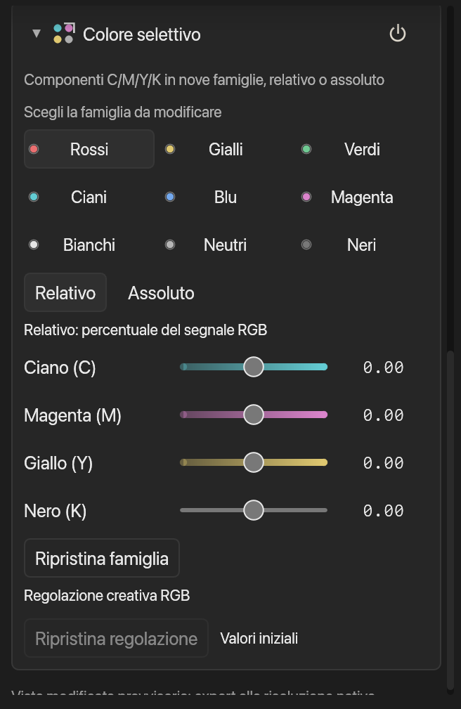

### Colorize

Apply a common hue with separate chroma and brightness controls. Increase the amount to blend in the chosen colour and adjust the balance to suit the image.

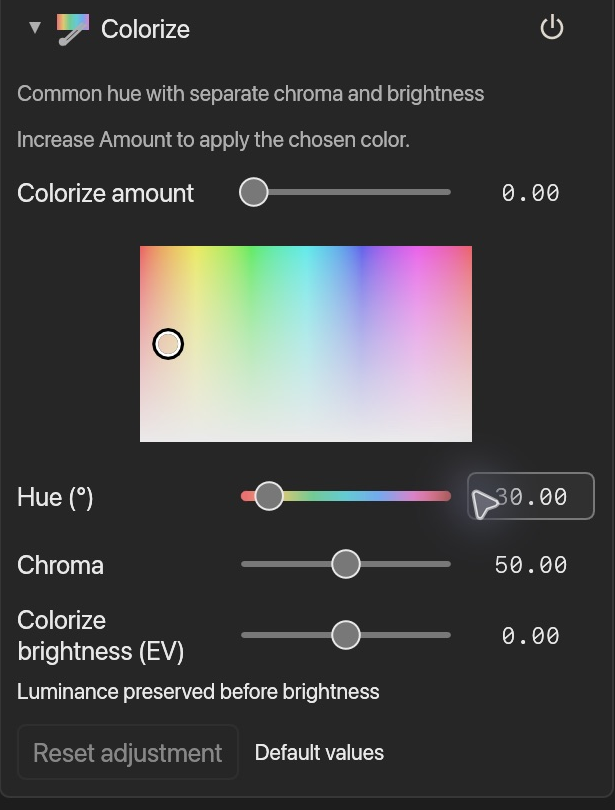

### Tonal controls

Refine exposure, brightness, contrast, shadows, highlights, blacks and whites on a layer. Mask the layer to give one part of the image its own tonal balance.

### Exposure, offset and gamma

Adjust signal gain, offset and gamma in a dedicated layer tool. The controls provide a direct way to shape brightness and tonal response with the order exposure, offset, then gamma.

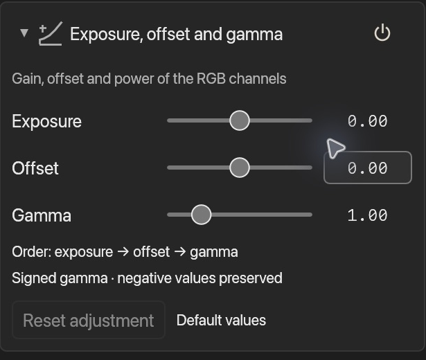

### Luminance curve

Shape light and contrast with a point curve on luminance while preserving colour differences. Place points to target selected brightness ranges and refine their coordinates numerically.

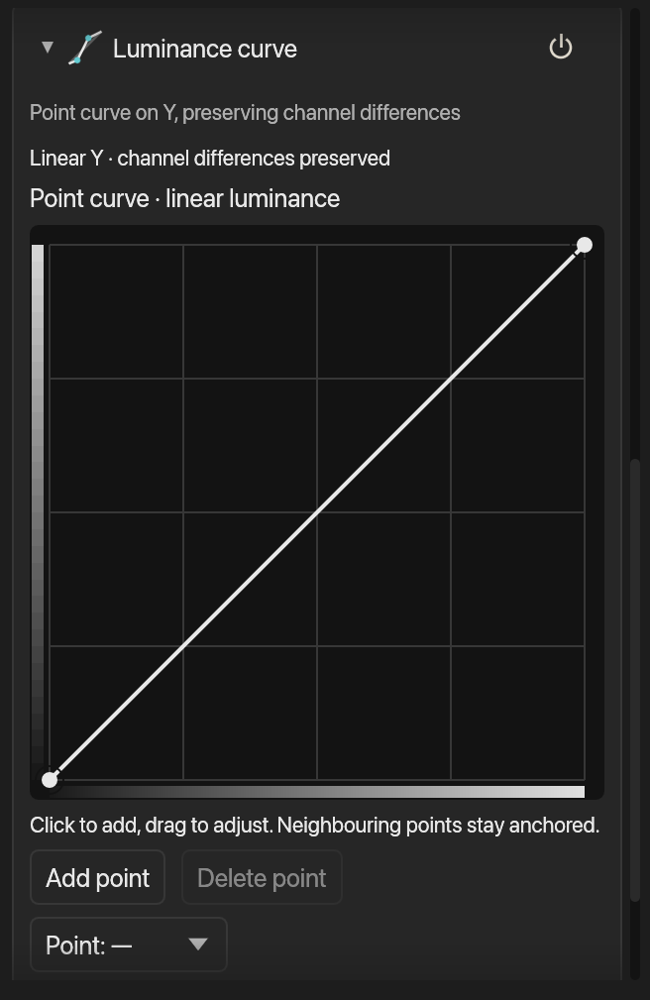

### Parametric curves

Adjust four tonal zones and the three boundaries between them. Choose luminance or RGB to shape the response, then tune zone transitions for the contrast you want.

Color editor: range and Before/After colour samples

Refine the sampled range with feathering, hue, saturation and luminance controls. The Before/After swatches show the effect on the selected colour sample.

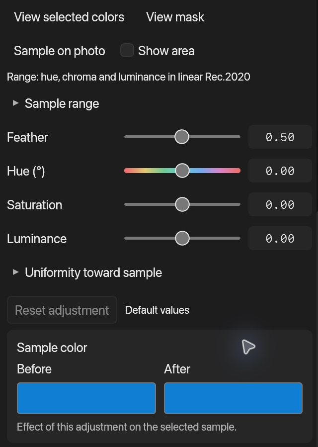

## Layers that follow your subject

### Layer blending

Set overall opacity, then use tonal fade and separate shadow/highlight blending to control where the layer contributes by brightness. These tonal controls complement spatial masks for finer integration.

### Brush mask

Paint the region where the selected layer should act. Adjust radius and feathering, invert the mask when useful, and combine components with Add, Subtract or Intersect.

### Gradient mask

Drag on the photograph to set a gradual transition, then refine its angle, width and feathering. Use it to ease an adjustment across the frame, for example between sky and foreground.

### Radial mask

Drag to position a soft elliptical region around the area you want to adjust. Refine the radius and feathering, or invert the mask to work on the surrounding area.

### Luminance mask

Choose the start and end of a brightness range and soften its boundaries with feathering. This lets an adjustment follow the image’s tones rather than a hand-drawn outline.

### Colour mask

Sample a colour on the photograph and control the hue, chroma and luminance widths of its range. Feather the transition and combine it with other mask components to refine the target area.

## Organize, compare and revisit

### Photo browser

Browse a shoot in the grid and filmstrip, search filenames and keywords, and narrow the selection with ratings and labels. Manual and smart albums collect references to photographs without moving the originals.

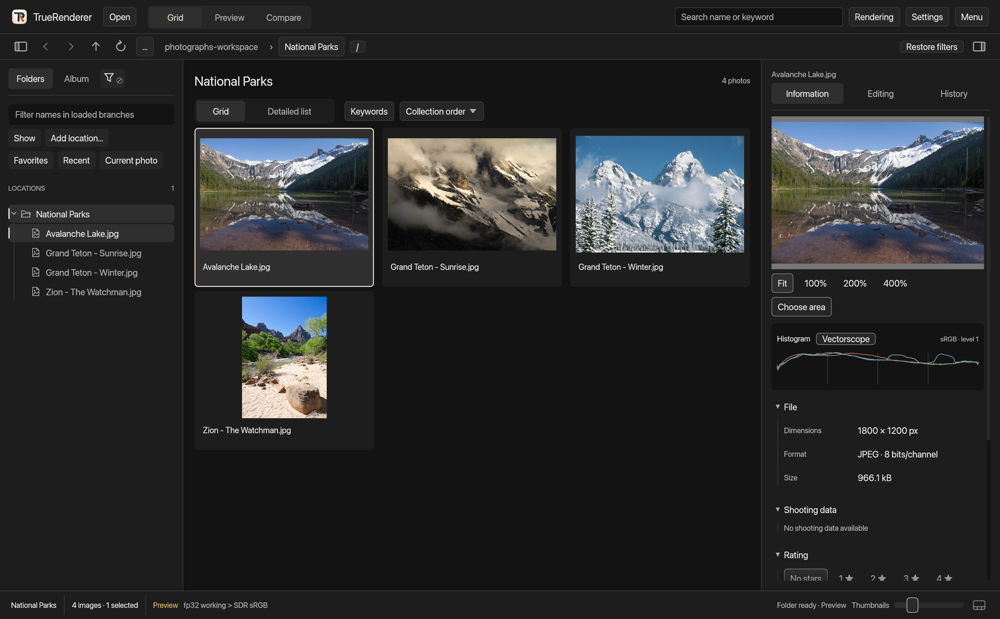

### Compare

Place photographs side by side or use the wipe view to compare them. Synchronized navigation and colour samplers help you judge detail and colour while choosing a frame.

### Information and ratings

Read image dimensions, format and available capture data alongside the photograph. Stars, colour labels and keywords help turn a folder of images into a useful selection.

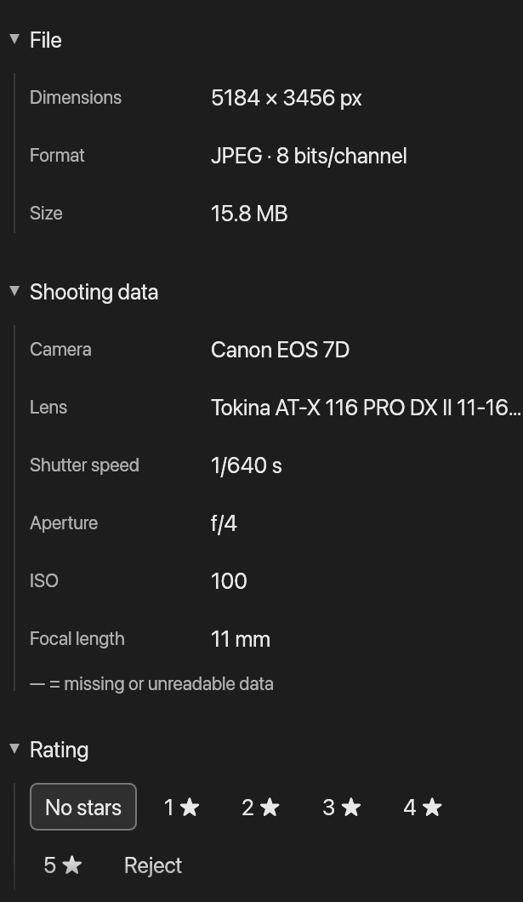

### Editable history

Return to a saved editing state or move forward again with Undo/Redo. The history keeps previous decisions accessible as you explore different versions of a photograph.

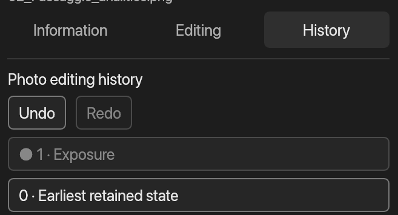

## Rights and credits

TrueRenderer is proprietary software, available with the owner's permission under its [license](https://github.com/antoniodicoratoinfodev/TrueRenderer-releases/blob/1819af3e1da9c6f5615c5d4ba20effa26ae7532e/docs/LICENSE). See [third-party notices and photograph credits](https://github.com/antoniodicoratoinfodev/TrueRenderer-releases/blob/1819af3e1da9c6f5615c5d4ba20effa26ae7532e/docs/NOTICE.md).
